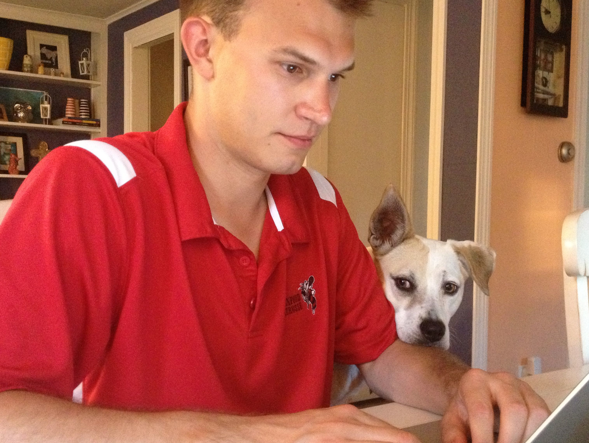

# Introduction

## What this book covers

Staff at many schools, districts, and state departments of education can feel like they are adrift in a sea of data. Highly skilled personnel are needed to help them navigate this information properly and chart the best possible course forward for the students they serve. More often than not, this effort will require the capacity of several analysts. 

Many education agencies have responded to this need by hiring multiple analysts, but they are often put to work in specific program areas and operate in isolation. This may help solve short-term data needs, but it is an under-utilization of personnel that share a valuable skill set. **Data analysts, particuarly those working in education agencies, can dramatically improve their productivity, quality, and capacity by adopting collaborative practices from the software development world.**

## Book organization

This book starts with an argument for collaborative data analysis in education agencies, but then pivots to practical advice that can be adopted by analysts in any sector, including advice on:

- Building a strong team culture
- Evaluating the tools your team uses
- Developing strong communication practices
- Creating systems to promote team collaboration
- Identifying and addressing pain points

## Acknowledgements

I wrote this book as part of my Capstone Project for the Strategic Data Project Fellowshop. It represents the culmination of two years of conferences, Google Hangouts, workshops, and gallons and gallons of coffee. Many people helped me along the way to make this project a success, including:

* My wife Samantha, for supporting me every step of the way.

* All of the incredible people I met through the Strategic Data Project: my fellow Cohort 7 Fellows, fellows from other cohorts, my capstone project advisor - [Jared Knowles](https://github.com/jknowles), and all of the SDP staff. 
  
* My Kentucky Department of Education colleagues, particularly those involved in the Strategic Data Project program: my supervisor Karen Dodd, and former/current fellows Bart Liguori, Aaron Butler, and Hannah Poquette.

* [Andrew Martin](https://github.com/almartin82), who caught a typo and submitted a pull request.

* Last but not least, Bailey - my favorite coding partner.



## Colophon

This book is powered by <https://bookdown.org> and was built with:

```{r}
devtools::session_info()
```